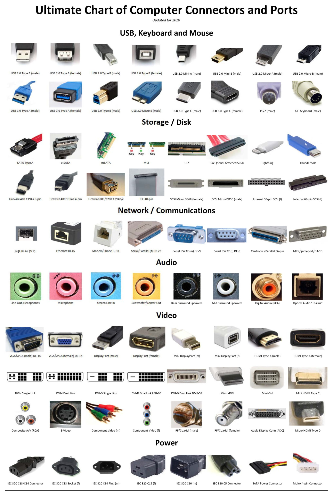

# Adapter
## Verschiedene Adapter Typen

Bild Quelle: [prrcomputers](https://www.prrcomputers.com/wp-content/uploads/2020/08/Ultimate-Connectors-scaled.jpg)

## Wichtige Mainboard Adapter

Bild Quelle: [notebooksbilliger.de](https://img.notebooksbilliger.de/images/misc/GA-Z87X-SLI_panel.jpg)

Bild Quelle: [reichelt.de](https://www.reichelt.de/reicheltpedia/images/b/b5/Backpanel-Anschl%C3%BCsse.jpg)

### Unterstützte Anschlüsse & Bildraten
| Auflösung & Hz | Anschlüsse                                                                          |
|----------------|-------------------------------------------------------------------------------------|
| 4K @ 60Hz      | HDMI 2.0+ (ab 2013), DisplayPort 1.2+ (ab 2010), USB-C/Thunderbolt 3+ (ab 2015)     |
| 4K @ 120Hz     | HDMI 2.1+ (ab 2017), DisplayPort 1.3+ (ab 2014)                                     |
| 8K @ 60Hz      | HDMI 2.1+ (ab 2017), DisplayPort 1.4+ (ab 2016), Thunderbolt 4+ (ab 2015)           |
| 8K @ 120Hz     | HDMI 2.2 (ab 2024), DisplayPort 2.0+ (ab 2019), Thunderbolt 5 (ab 2023)             |
