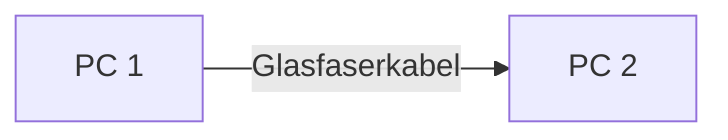

# OSI Layers 1, 2 & 3
## Layer 1 – Bitübertragungsschicht

Die **Bitübertragungsschicht (Physical Layer)** ist die unterste Schicht des OSI-Modells.  
Sie definiert, **wie Bits physisch über ein Übertragungsmedium übertragen werden**.

**Übertragungseinheit:** Bit

---

### Minimalbeispiel


**Beispiel:**



**Mögliche Übertragungsmedien:**

- Kupferkabel (Twisted Pair / Ethernet)
- Glasfaser
- Funk (WLAN)

---

### Aufgaben von Layer 1

- Definition von **Kabeln und Steckern** (z. B. RJ45)
- Definition der **Signalübertragung** (elektrisch, optisch, Funk)
- **Bitübertragung**
- Festlegung von **Übertragungsraten** (z. B. 1 Gbit/s)


### Geräte auf Layer 1

**Passive Komponenten**

- Kabel
- Stecker
- Hub (verteilt Signal an alle Ports)
- Repeater (Signalverstärkung)

---

## Fehlersuche (VW-FS)

**Typische Probleme:**

- Kabel nicht eingesteckt
- Stecker locker
- Kabel defekt
- keine physische Verbindung

**Prüfen:**

- LEDs an Netzwerkkarte oder Switch
- Kabeltester verwenden

---

### Überprüfung unter Linux

Physische Netzwerkverbindungen können mit folgendem Befehl geprüft werden:

```bash
ip link
```

> ### Prüfungsfragen
> - Welche Übertragungseinheit hat Layer 1?
> - Nennen Sie zwei Geräte, die auf Layer 1 arbeiten.
> - Welche Aufgaben hat die Bitübertragungsschicht?
> - Was bedeutet NO-CARRIER bei einer Netzwerkschnittstelle?

## Layer 2 – Sicherungsschicht (Data Link)

Layer 2 organisiert die **Kommunikation innerhalb eines lokalen Netzwerks (LAN)**.  
Er sorgt dafür, dass **Frames an das richtige Gerät im selben Netzwerk gesendet werden**.

**Übertragungseinheit:** Frame  
**Adressierung:** MAC-Adresse

---

### Grundprinzip

```mermaid
graph LR
    S[Sender] -->|Frame zu MAC: DD:EE:FF| SW[Layer 2 Switch]
    SW -->|Unicast| E[Empfänger]
    SW -.->|kein Frame| A[Anderes Gerät]
````

Mehrere Geräte sind in einem **LAN** verbunden.

Ziel von Layer 2:

* Jeder **Frame erreicht nur das Zielgerät**
* unnötiger Netzwerkverkehr wird reduziert

---

### Geräte auf Layer 2

**Netzwerkkarte (NIC)**

* besitzt eine **MAC-Adresse**

**Switch**

* verbindet viele Geräte im LAN
* hat mehrere **Ports**
* leitet Frames nur zum **richtigen Zielport**

Ein Switch **trennt Kollisionsdomänen** zwischen seinen Ports.

---

### Hub vs. Switch

**Hub (Layer 1)**

* sendet Signale an **alle Geräte**
* viele **Kollisionen**
* ineffizient

**Switch (Layer 2)**

* nutzt **MAC-Adressen**
* sendet Frames **nur an das Zielgerät**
* reduziert Netzwerkverkehr

---

### Zugriffsverfahren

Wenn mehrere Geräte ein Medium nutzen:

* **CSMA/CD** → Ethernet (Kabel)
* **CSMA/CA** → WLAN

**Kollisionsdomäne:**
Bereich eines Netzwerks, in dem **Datenkollisionen auftreten können**.

---

### Ethernet

Wichtigstes Protokoll auf Layer 2.

Aufgaben:

* Aufbau des [**Ethernet-Frames**](https://belgarus.github.io/Notes/fi25/lf3_networking/book/ethernet.html)
* **MAC-Adressierung**
* **Fehlererkennung** (Prüfsumme / FCS)

---

### Typische Topologie


Switches bilden den Mittelpunkt des Netzwerks.

---

## Fehlersuche

### MAC-Adresse anzeigen

**Windows**

```cmd
ipconfig /all
```

**Linux**

```bash
ifconfig -a # Lists all networkinterfaces + their MAC adresses
```

---

## Prüfungsfragen

* Welche **Übertragungseinheit** hat Layer 2?
* Welche **Adressierung** wird verwendet?
* Welche Aufgabe hat ein **Switch**?
* Was ist der Unterschied zwischen **Hub und Switch**?
* Was ist eine **Kollisionsdomäne**?
