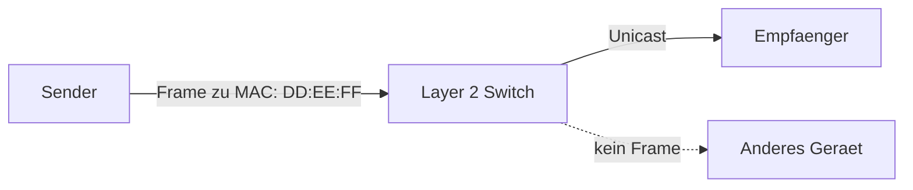

# Einführung

R. und N. hatten für das *Selbstorganisierte lernen*  (SOL) die Idee einen umanaged Layer 2 Switch zu bauen oder simmulieren.  

## Ziel (naiv, deprecated, Version 1)

* Mit GPIO und Microcontroller/RPI einen Layer 2 Switch bauen, welcher mit Pcs über Twisted Pair kommunizieren kann
* Eine einfache Nachricht verschicken
* (Optional) Paketsniffer bauen und gesendete Datenpakete analysieren
    - Man in the Middle am Beispiel zeigen
* (Optional) Über http eine Übersicht geben über den Aufbau, Inhalt der gesendeten Pakete

### Vorgehen
1. Über Protokolle(Ethernet, Manchester Kodierung) informieren, Anforderungen festhalten
3. Die physische Layer definieren 
4. richtigen Mikrocontroller / Einplatinencomputer wählen, der den Anforderungen entspricht
5. Projekt mit Micropython implementieren

### Anforderung
 - Presentationsmedium (HedgeDoc oder mdBook)
 - Evt. Physisches Gerät

### Diagramm

## Ziel (Version 2)

- eine Simulation für einen Layer-2 Netzwerkswitch bauen, Netzwerk ist fest vorgegeben (2 Netzwerkgeräte, 1 Switch)
- (Optional) Netzwerk variabel aufbauen
- (Optional) GUI

**Vorteile:**
- Konzepte verstehen unabhängig von technischen Implementierungen
- wir können entscheiden auf welchen Level abstrahiert wird

**Nachteile:**
- keine Kontrolle(durch Probe) möglich, ob Ethernet Standart korrekt umgesetzt wurde

### Vorgehen 

1. Erkenntnisse aus vorheriger Recherche festhalten
2. Anforderungen festhalten
    - welche Aufgaben hat Layer 1+2 (Switch und Endgeräte)
    - welche Funktionalität soll die Simulation haben
    - Wie technisch/physikalisch soll implementiert werden
    - Eingabe ? Ausgabe ? -> über terminal, Textdateien ?
    - Zeitbasiert Simulation oder Eventbasierte simulation ?
3. Software Projekt planen
    - Aufteilen in Teilbereiche(z.B. Ein Ausgabe, Netzwerkkomponenten, Kodierungen, Nachrichten, Leitungen, ...) --> möglichst modular
    - (UML Klassendiagramm ???)

4. Software Projekt umsetzen
    - Implementierung alleinstehender Klassen
    - Implementierung zusammenhängender Klassen
    - (Testen ???) 

### Anforderung

- funktionierende Simulation eines Layer 2 Switches und Endgeräte 
- Dokumentation in Hedgedoc (Übertragung in mdBook)

*Hinweis: die Bilder in Funktionsweise stammen aus dem Repo von R.: [layer 2 switch learning process](https://github.com/robertulrich21/layer2SwitchLearningProcess/)*
