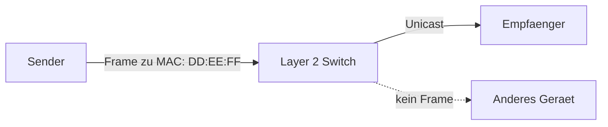

# Einführung

R. und N. hatten für das *Selbstorganisierte lernen*  (SOL) die Idee einen umanaged Layer 2 Switch zu bauen oder simmulieren.  

## Ziel (naiv, deprecated, Version 1)

* Mit GPIO und Microcontroller/RPI einen Layer 2 Switch bauen, welcher mit Pcs über Twisted Pair kommunizieren kann
* Eine einfache Nachricht verschicken
* (Optional) Paketsniffer bauen und gesendete Datenpakete analysieren
    - Man in the Middle am Beispiel zeigen
* (Optional) Über http eine Übersicht geben über den Aufbau, Inhalt der gesendeten Pakete

### Vorgehen
1. Über Protokolle(Ethernet, Manchester Kodierung) informieren, Anforderungen festhalten
3. Die physische Layer definieren 
4. richtigen Mikrocontroller / Einplatinencomputer wählen, der den Anforderungen entspricht
5. Projekt mit Micropython implementieren

### Anforderung
 - Presentationsmedium (HedgeDoc oder mdBook)
 - Evt. Physisches Gerät

### Diagramm
