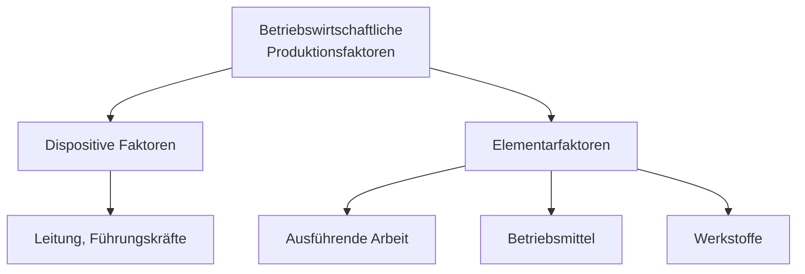
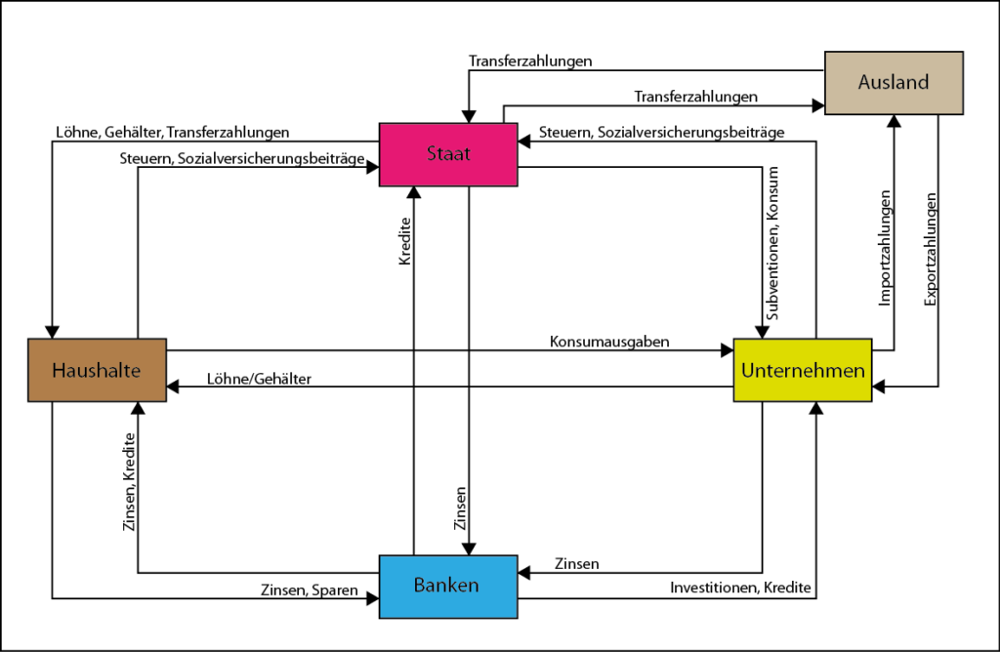
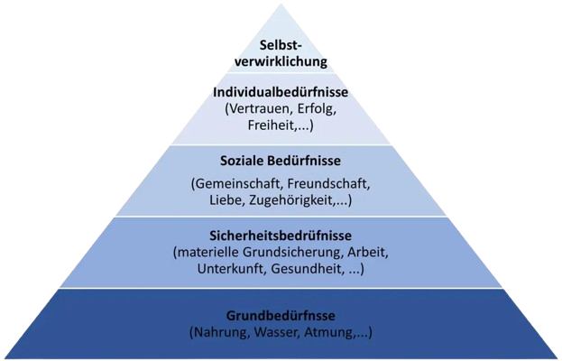
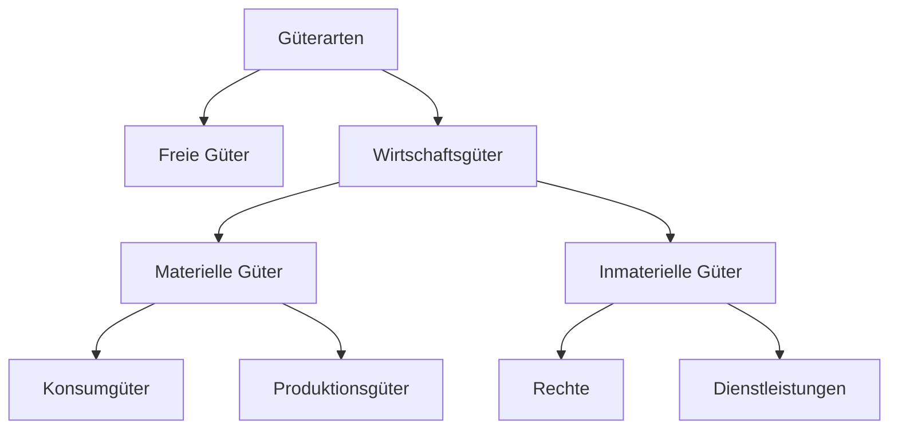

# Wirtschaftliche Grundlagen

## Was ist Wirtschaft?
Plannvoller Umgang mit knappen Ressourcen zu bestmöglichen Befriedigung unbegrenzter Bedürfnisse.
> **Problem:** knappe Ressourcen / unbegrenzte Bedürfnisse

### Betriebswirtschaftliche Produktionsfaktoren

Betriebswirtschaftliche Produktionsfaktoren sind die in Unternehmen eingesetzten Mittel, die gemeinsam zur Erstellung von Gütern und Dienstleistungen beitragen.

**Elementarfaktoren** sind die grundlegenden Bausteine, die ein Unternehmen für die Produktion braucht  
**Dispositive** Faktoren sind die planenden und steuernden Tätigkeiten, die alles zusammenbringen.

### Ökonomische Prinzipien (Wirtschaftlichkeitsprinzip)
Das ökonomische Prinzip besagt, dass Wirtschaftssubjekte ihre Mittel so einsetzen, dass ein möglichst gutes Verhältnis zwischen Aufwand und Ergebnis entsteht.

- **Minimalprinzip:** Mit möglichst wenig Mitteln ein vorgegebenes Ziel erreichen.  
- **Maximalprinzip:** Mit gegebenen Mitteln das Maximale erreichen.  
- **Optimumprinzip:** Das beste Verhältnis zwischen eingesetzten Mitteln und erzieltem Ergebnis finden.  

### Wie Ressourcenknappheit zur Arbeitsteilung führt:
Weil Ressourcen begrenzt sind, müssen Menschen effizient zusammenarbeiten. Arbeitsteilung ermöglicht, Aufgaben aufzuteilen und dadurch Zeit, Kosten und Aufwand zu sparen.

- **Innerfamiliär** – Aufgabenverteilung innerhalb der Familie  
- **Betrieblich** – Aufteilung von Arbeitsprozessen im Unternehmen  
- **Beruflich** – Spezialisierung auf bestimmte Berufe oder Tätigkeiten  
- **Volkswirtschaftlich** – Arbeitsteilung zwischen Branchen innerhalb eines Landes  
- **International** – Spezialisierung und Austausch zwischen Ländern  

| Vorteile der Arbeitsteilung | Nachteile der Arbeitsteilung |
|-----------------------------|------------------------------|
| Höhere Produktivität        | Abhängigkeiten               |
| Kostenvorteile              | Monotone Tätigkeiten         |
| Bessere Qualität            | Höhere Störanfälligkeit      |
| Spezialisierung             | Verlust ganzheitlicher Fähigkeiten |

### 3 Sektoren-Modell einer Volkswirtschaft
  

**Primärer Sektor:** Rohstoffgewinnung, **Sekundärer Sektor:** Rohstoffverarbeitung,  
**tertiärer Sektor:** Dienstleistungen

### (Erweiterter) Wirtschaftskreislauf

*Von [bilanz junkie - Wirtschaftskreislauf](https://www.bilanz-junkie.de/wp-content/uploads/2020/04/Offener-Wirtschaftskreislauf-1-1024x668.png)*

### Bedürfnisse, Bedarf und Nachfrage
| Begriff     | Definition |
|------------|------------|
| **Bedürfniss** | Gefühl eines Mangels, mit dem Wunsch, diesen zu beseitigen |
| **Bedarf** | Mit Geld abgedecktes (kaufkraftgestütztes) Verlangen nach Gütern zur Befriedigung der Bedürfnisse |
| **Nachfrage** | Teil des Bedarfs, der auf dem Markt durch eine Kaufentscheidung realisiert wird |

### Maslow‘sche Bedürfnispyramide
   

(**Blau**: Defizitbedürfnisse, **Weiß**: Wachstumsbedürfnisse)  
*Von [herzbluttigerevents - mitarbeiterzufriedenheit-steigern](https://herzbluttigerevents.de/mitarbeiterzufriedenheit-steigern/)*

### Arten von Gütern
Die Klassifikation von Gütern hilft zu verstehen, welche Ressourcen knapp sind und wie sie in der Wirtschaft verwendet werden.

Nur Wirtschaftsgüter haben einen Preis – ihre weitere Unterteilung zeigt, ob sie direkt konsumiert oder zur Produktion weiterer Güter eingesetzt werden.

### Betriebstypologien
Betriebstypologien sind Klassifikationen von Unternehmen nach Merkmalen wie z.B. Größe.

.
Betriebstypologien
├── Privat oder Staatlich
├── Größe
├── Rechtsform
├── Branche
└── ...

### Ökonomische, soziale und ökologische Ziele von Unternehmen
Unternehmen verfolgen ökonomische, soziale und ökologische Ziele, die jedoch oft in Konflikt zueinander stehen   
– deshalb müssen Prioritäten gesetzt und Kompromisse gefunden werden.

| Ökonomische Ziele              | Soziale Ziele                          | Ökologische Ziele                    |
|--------------------------------|----------------------------------------|-------------------------------------|
| Gewinnmaximierung               | Gutes Betriebsklima                     | Vermeidung von Abfällen             |
| Rentabilität                    | Mitarbeiterzufriedenheit               | Einsparung von Energie              |
| Absatz- und Umsatzsteigerung    | Förderung der Gleichberechtigung        | Nachhaltigkeit                       |
| Erhöhung des Marktanteils       | Schaffung/Erhalt von Arbeitsplätzen    | Umweltverträglichkeit               |
| Produktivität                   | Ausbau sozialer Leistungen              | Recycling                            |
| Senkung der Kosten              | Vereinbarkeit von Beruf und Familie    | Umweltfreundliche Produkte          |
| Beseitigung der Konkurrenz      | Zahlung angemessener Vergütung          | Umstieg auf erneuerbare Energien    |
| Kundenzufriedenheit             | Sponsoring sozialer Projekte            | Dämmung der Gebäude                  |
| …                               | …                                      | …                                   |
