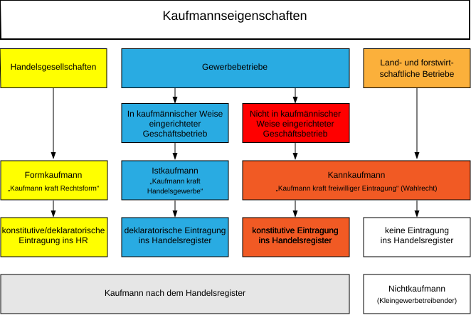

# Rechtsformen und Führung von Unternehmen

## 1.1 Unternehmenszahlen nach Beschäftigtenzahl

| Merkmal                                   | 0–9 Beschäftigte | 10–49 Beschäftigte | 50–249 Beschäftigte | ≥250 Beschäftigte | Insgesamt |
|-------------------------------------------|-----------------|------------------|-------------------|-----------------|-----------|
| **Einzelunternehmer**                      | 1.954.811       | 89.627           | 3.540             | 85              | 2.048.063 |
| **Personengesellschaften (OHG, KG)**      | 335.851         | 64.122           | 14.322            | 3.231           | 417.526   |
| **Kapitalgesellschaften (GmbH, AG)**      | 591.177         | 181.460          | 49.919            | 11.334          | 833.890   |
| **Sonstige Rechtsformen**                  | 132.816         | 27.618           | 7.328             | 2.677           | 170.439   |
| **Insgesamt**                              | 3.014.655       | 362.827          | 75.109            | 17.327          | 3.469.918 |

*2023 laut [statistica.com - Unternehmen in Deutschland](https://de.statista.com/statistik/daten/studie/237346/umfrage/unternehmen-in-deutschland-nach-rechtsform-und-anzahl-der-beschaeftigten/)*

## 1.2. Übersicht über die Rechtsformen

.
Rechtsformen von Unternehmen
├── Einzelunternehmen
│   ├── Kleingewerbetreibender
│   └── Eingetragener Kaufmann (e.K.)
├── Personengesellschaften
│   ├── Gesellschaft bürgerlichen Rechts (GbR)
│   ├── Offene Handelsgesellschaft (OHG)
│   └── Kommanditgesellschaft (KG)
├── Kapitalgesellschaften
│   ├── Gesellschaft mit beschränkter Haftung (GmbH)
│   ├── Unternehmergesellschaft (haftungsbeschränkt) (UG)
│   └── Aktiengesellschaft (AG)
└── Genossenschaften

## 1.3. Kriterien zur Wahl der Rechtsform

* **Finanzen:** Kapitalaufbringung, Finanzierungsmöglichkeiten
* **Haftung:** Wer haftet? Umfang der Haftung
* **Organisation:** Leitung, Vertretung, Gewinnverteilung
* **Kosten & Steuern:** Steuerbelastung, Gründungs- und Buchhaltungskosten

## 2.1 Die Firma eines Kaufmannes
Als Firma wird der Name, unter dem der Kaufmann im Sinne des HGB  
seine Geschäfte führt, bezeichnet.
* **Personenfirma** z.B. Jens Große GmbH
* **Sachfirma** z.B. Betonhandel Dittersdorf OHG
* **Fantasiefirma** z.B. Grand Unicorn AG
* **Mischfirma** z.B. Große and friends Betonhandel Dittersdorf OHG

| Grundsatz                        | Bedeutung                                                                     |
|----------------------------------|-------------------------------------------------------------------------------|
| **Firmenöffentlichkeit**         | Eintragung der Firma ins Handelsregister ist Pflicht.                        |
| **Firmenbeständigkeit**          | Weiterführung der Firma bei Inhaberwechsel ist möglich.                      |
| **Firmenausschließbarkeit**      | Firmenname muss sich klar von anderen Firmen unterscheiden.                  |
| **Irreführungsverbot**           | Firmenname darf nicht über Gesellschaftsverhältnisse täuschen.               |
| **Offenlegung der Haftungsverhältnisse** | Durch Firmenzusatz und Handelsregistereintrag offenzulegen.          |
| **Offenlegung der Gesellschaftsverhältnisse** | Ebenfalls durch Firmenzusatz und Handelsregistereintrag sicherzustellen. |

## 2.2 Handelsregister
Das **Handelsregister** ist ein öffentliches Verzeichnis, in dem alle wesentlichen Informationen über Kaufleute und Unternehmen im Bezirk des jeweiligen Amtsgerichts eingetragen werden.
- Kleingewerbe und GbRs nicht eintragungspflichtig  
- Enthält rechtliche und wirtschaftliche Informationen (§15 HGB)  
- Elektronische Anmeldung, Änderungen und Löschungen  
- **Abteilungen:**  
  - A (HRA): Einzelkaufleute, Personengesellschaften, Vereine  
  - B (HRB): Kapitalgesellschaften

| Inhalt nach Handelsregisterverordnung | Beschreibung / Details |
|--------------------------------------|----------------------|
| **Firma**                             | Vertretungsberechtige Personens |
| **Sitz und Geschäftsanschrift**   | Rechtsform des Unternehmens |
| **Niederlassungen und Anschriften**       | Grund- oder Stammkapital |
| **Gegenstand des Unternehmens**       | Sonstige Gesellschafter (Kommanditisten) |
| **Sonstiges**  (Insolvenzverfahren, laufende Umwandlung der Rechtsform, …)      | Einsehbarkeit weiterer Dokumente |

**Hinweis:** Eintragungen können **konstitutiv** (rechtserzeugend) oder **deklaratorisch** (rechtsbezeugend) sein.

## 2.2 Arten von Kaufläuten

*von [Lernnetz 24 - Kaufmannseigenschaft ](https://www.lernnetz24.de/bwl/hinweise/90.html)*

## 3. Arten von Rechtformen

### 3.1 Einzelunternehmung

### 3.1.1. Wahlmöglichkeit des Einzelunternehmers
**Einzelunternehmer** kann wählen zwischen:

* **Kleingewerbetreibender** – wenn keine kaufmännische Organisation nötig ist
* **Eingetragener Kaufmann** (e.K.) – freiwillig oder bei größerem Geschäftsbetrieb
* Alleinige Gründung einer **Kapitalgesellschaft** – GmbH/UG oder AG

### 3.1.2. Kleingewerbetreibender (nicht eingetragen)
| Merkmal              | Beschreibung                                   |
| -------------------- | ---------------------------------------------- |
| **Gründung**         | Anmeldung beim Gewerbeamt und Finanzamt        |
| **Firma**            | Keine Firma, Geschäfte mit Vor- und Nachname   |
| **Kapital**          | Keine Mindesthöhe vorgeschrieben               |
| **Geschäftsführung** | Durch Kleingewerbetreibenden selbst            |
| **Haftung**          | Unbeschränkt mit Geschäfts- und Privatvermögen |
| **Gewinnverteilung** | Keine Verteilung notwendig                     |
| **Organe**           | Keine                                          |

**Besonderheiten / Vereinfachungen beim Kleingewerbetreibenden**
* Keine Eintragung im Handelsregister
* Geringere Buchhaltungspflichten
* Regeln des HGB gelten nicht für den Kleingewerbetreibenden
* Evtl. Umsatzsteuerbefreiung (Vorjahr max. 22.000 €, aktuelles
Jahr voraussichtlich max. 50.000 €)

> **Exkurs:** Bei Handelskäufen muss ein Kaufmann Mängel unverzüglich rügen *(reklamieren)*; die Fristen richten sich nach Art des Mangels und können zwischen sofortiger Anzeige und maximal drei Jahren liegen.