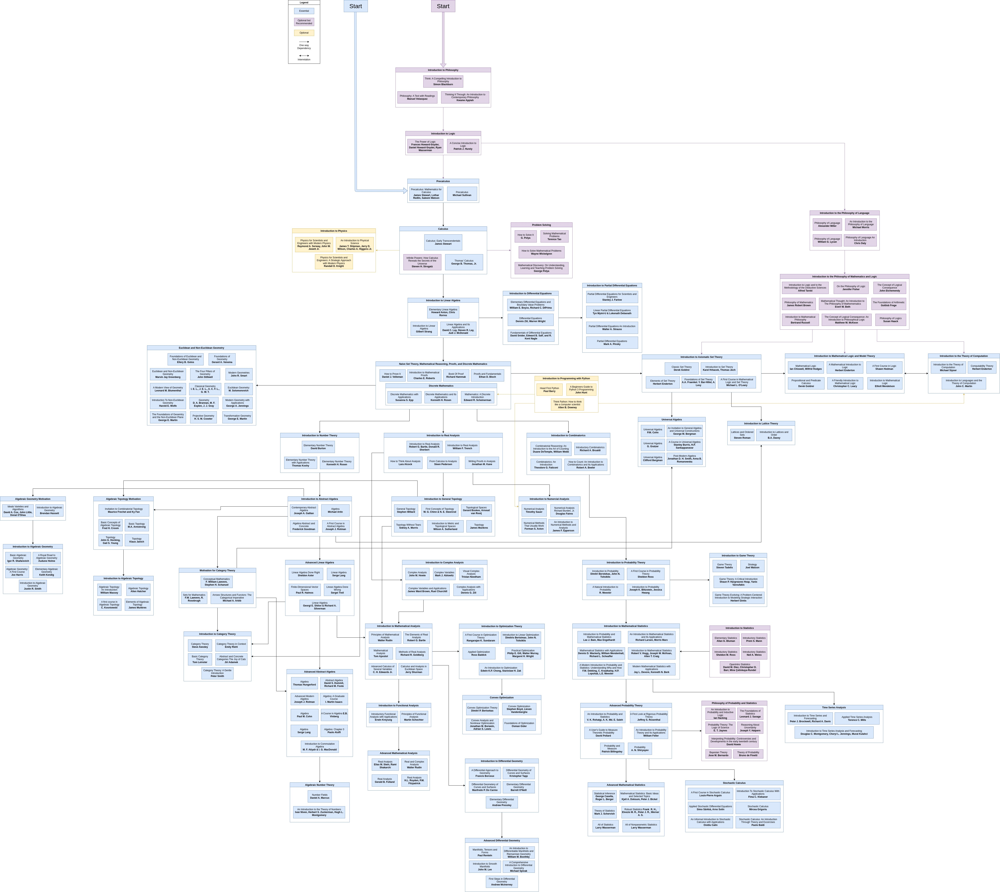

# A List Of The Different Resources

There are different learning approches for different type of people, I will only look at the free online ones

### [1. OSSU Curriculum Mathematics](https://github.com/ossu/math)

A complete, degree-equivalent education in mathematics, crafted entirely from online materials. This structured curriculum is designed to meet the standards of an undergraduate math major, providing a clear learning path that typically spans two years. It's perfect for dedicated learners seeking a thorough and systematic foundation. It's mostly based on curses.

### [2. Mathematics Roadmap](https://github.com/TalalAlrawajfeh/mathematics-roadmap)

    

        
Dive into mathematics through a carefully selected collection of books and exercises. This roadmap is more than a list; it's guided by a learning philosophy that emphasizes deep understanding, metacognition, and problem-solving. It’s an excellent choice for those who learn best by reading and engaging deeply with fundamental texts.

    

    

        
    

### [3. Self Study Map Mathematics](https://tagvault.org/blog/self-study-map-mathematics/)
A thoughtfully curated collection designed to make mathematics accessible and engaging. This resource prioritizes pedagogical effectiveness and learner motivation over traditional, often overwhelming, textbooks. It's a shorter, high-quality starting point that helps you build momentum and enjoy the learning process

### How to choose:

Your note is key—the best resource is the one that fits you best. To decide:

* For a structured, degree-like path, choose [OSSU](#1-ossu-curriculum-mathematics).  
* For a deep, philosophy-guided journey with books, choose the [Mathematics Roadmap](#2-mathematics-roadmap).
* For a gentler, curated introduction, start with the [Self Study Map](#3-self-study-map-mathematics).

### Note
There are way more resources but these were the most fitting for me.